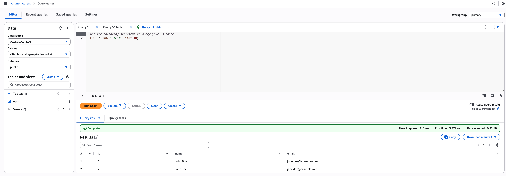

import { Aside, Steps, Tabs, TabItem } from '@astrojs/starlight/components';

This guide walks you through configuring AWS S3 table buckets as an external catalog in Embucket. Currently, Embucket supports S3 table buckets as the sole external catalog. AWS S3 table buckets provide built-in table maintenance, automatic compaction, and optimization features.

## What you'll learn

Follow this guide to:

- Create an AWS S3 table bucket using the AWS command-line tool
- Configure Embucket with an S3 table bucket as an external catalog
- Explore schemas, tables, and existing data
- Create tables and load data using familiar SQL commands
- Verify table creation and query data through AWS Console

## What this guide covers

This guide covers basic setup and usage of S3 table buckets with Embucket. Advanced table maintenance features, cross-region replication, and enterprise security configurations fall outside the scope of this guide.

<Aside type="note">
  S3 table buckets offer built-in table maintenance, automatic compaction, and optimization
  features.
</Aside>

## Prerequisites

Before you begin, verify you have:

- AWS command-line tool installed and configured with appropriate permissions
- Embucket instance running locally or in your environment
- Valid AWS credentials with S3 Tables service permissions

## Understanding AWS S3 table buckets

AWS designed S3 table buckets specifically for tabular data storage. They provide:

- **Automatic optimization**: Built-in compaction and file organization
- **Schema enforcement**: Native support for table schemas and metadata
- **Query performance**: Optimized for analytical workloads
- **AWS integration**: Seamless integration with Athena, Glue, and other AWS services

<Aside type="caution">
  Each S3 table bucket in Embucket maps to exactly one database. You specify the database name in
  the configuration file.
</Aside>

## Create an S3 table bucket

<Steps>

1. **Create the table bucket**

   Use the AWS command-line tool to create your S3 table bucket:

   ```bash
   aws s3tables create-table-bucket --name my-table-bucket --region us-east-2
   ```

   The command returns the bucket ARN:

   ```json
   {
     "arn": "arn:aws:s3tables:us-east-2:123456789012:bucket/my-table-bucket"
   }
   ```

2. **Record the bucket information**

   Save the following information for the next step:
   - **Bucket name**: `my-table-bucket`
   - **Region**: `us-east-2`
   - **ARN**: The full ARN returned by the command

</Steps>

## Configure an Embucket volume

In Embucket, volumes store data and metadata. Define configuration statically in the configuration file. Specify the configuration file location with the `--metastore-config` flag or the `METASTORE_CONFIG` environment variable.

Create a section in the config file `volumes` and add an entry for the S3 table bucket volume.

```yaml
volumes:
  - ident: embucket
    type: s3-tables
    database: demo
    credentials:
      credential_type: access_key
      aws-access-key-id: ACCESS_KEY
      aws-secret-access-key: SECRET_ACCESS_KEY
    arn: arn:aws:s3tables:us-east-2:123456789012:bucket/my-table-bucket
```

Parameters:

- `ident`: Volume identifier
- `type`: Volume type `s3-tables`. This remains the only supported type.
- `database`: Database name that maps to this volume
- `credentials`: AWS access credentials
- `arn`: Full S3 table bucket ARN

<Aside type="tip">
  Replace `YOUR_ACCESS_KEY` and `YOUR_SECRET_KEY` with your actual AWS credentials, and update the
  ARN with your specific account ID and bucket details.
</Aside>

## Explore schemas and tables

Explore schemas and tables in the S3 table bucket using the Snowflake command-line tool or any Snowflake-compatible tool. Use [Snowflake command-line tool guide](/guides/snowflake-cli) for the information on how to connect to Embucket.

<Steps>

1. **Connect to Embucket**

   Start a Snowflake command-line tool session:

   ```bash
   snow sql -c local
   ```

2. **Explore schemas and tables**

   Explore schemas and tables:

   ```sql
   SHOW SCHEMAS IN demo;
   ```

   Output:

   ```
   +----------------------------------------------------------------------------+
   | created_on | name                     | kind | database_name | schema_name |
   |------------+--------------------------+------+---------------+-------------|
   | None       | public                   | None | demo          | None        |
   | None       | public_derived           | None | demo          | None        |
   | None       | public_scratch           | None | demo          | None        |
   | None       | public_snowplow_manifest | None | demo          | None        |
   | None       | tpcds_10                 | None | demo          | None        |
   | None       | tpcds_100                | None | demo          | None        |
   | None       | tpch_10                  | None | demo          | None        |
   | None       | tpch_100                 | None | demo          | None        |
   | None       | information_schema       | None | demo          | None        |
   +----------------------------------------------------------------------------+
   ```

3. **Explore tables**

   Explore tables:

   ```sql
   SHOW TABLES IN demo.tpch_10;
   ```

   Output:

   ```
   +-------------------------------------------------------------+
   | created_on | name     | kind  | database_name | schema_name |
   |------------+----------+-------+---------------+-------------|
   | None       | orders   | TABLE | demo          | tpch_10     |
   | None       | nation   | TABLE | demo          | tpch_10     |
   | None       | customer | TABLE | demo          | tpch_10     |
   | None       | part     | TABLE | demo          | tpch_10     |
   | None       | lineitem | TABLE | demo          | tpch_10     |
   | None       | partsupp | TABLE | demo          | tpch_10     |
   | None       | region   | TABLE | demo          | tpch_10     |
   | None       | supplier | TABLE | demo          | tpch_10     |
   +-------------------------------------------------------------+
   ```

4. **Create a table with data**

   Create and populate a table in one command:

   ```sql
   CREATE TABLE demo.public.users (
       id INT,
       name VARCHAR(100),
       email VARCHAR(100)
   ) AS VALUES
       (1, 'John Doe', 'john.doe@example.com'),
       (2, 'Jane Doe', 'jane.doe@example.com');
   ```

   Output:

   ```
   +-------+
   | count |
   |-------|
   | 2     |
   +-------+
   ```

5. **Query the table**

   Verify you can read the data:

   ```sql
   SELECT * FROM demo.public.users;
   ```

   Output:

   ```
   +----+----------+----------------------+
   | id | name     | email                |
   |----|----------|----------------------|
   | 1  | John Doe | john.doe@example.com |
   | 2  | Jane Doe | jane.doe@example.com |
   +----+----------+----------------------+
   ```

</Steps>

## Verify in AWS console

Verify table creation and query your data directly through AWS services:

<Steps>

1. **Open AWS Console**

   Navigate to the S3 Tables service in the AWS Console.

2. **Locate your table bucket**

   Find the `my-table-bucket` you created earlier.

3. **Browse tables**

   Inside the table bucket, you see:
   - Database: `demo`
   - Table: `users`

4. **Query with Athena**

   Select the `users` table and choose "Query table with Athena." The SQL editor opens with your table ready for queries.

</Steps>



## Next steps

Now that you have S3 table buckets working with Embucket, consider:

- **Integration**: Connect BI tools and data pipelines to your Embucket instance
