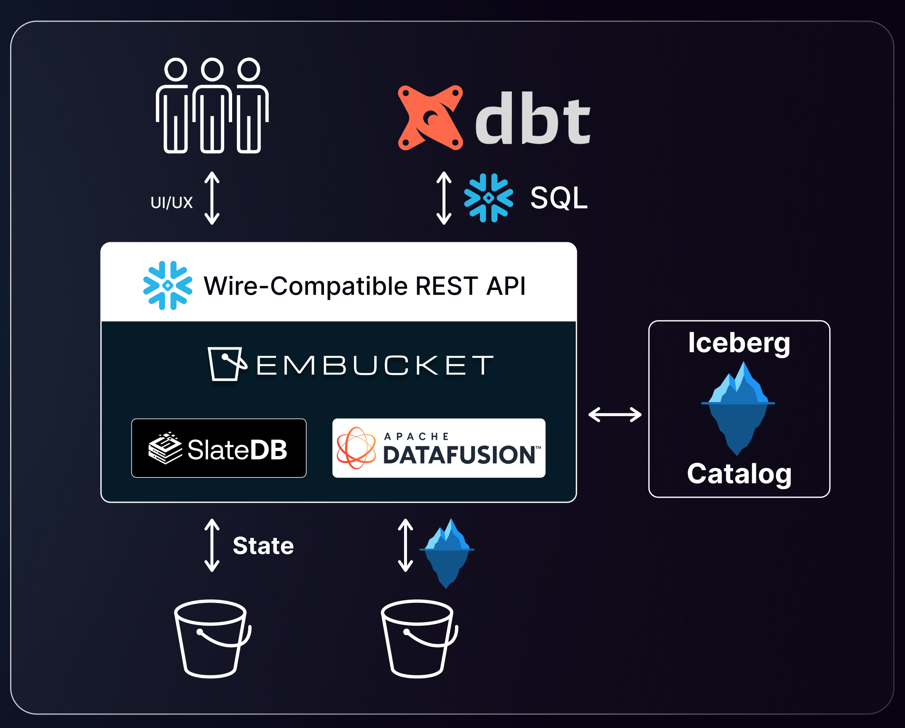

import { Aside } from '@astrojs/starlight/components';

Embucket exposes a Snowflake-compatible API over lakehouse data. The system separates into five layers: runtime, metadata, storage, query execution, and authentication.

## Runtime

Embucket runs as an AWS Lambda function (`embucket-lambda`) for production deployments. A local binary is also available through Docker for development and testing. Both entry points share the same Snowflake-compatible API router.

<Aside type="tip">
  See [AWS Lambda deployment](/deploy/aws-lambda/) for production setup instructions.
</Aside>

## Metadata

Embucket loads metadata from a YAML metastore file or external catalogs. You can define metadata through three paths:

- **YAML metastore config** -- Set the `METASTORE_CONFIG` environment variable to point to a YAML file that declares volumes, databases, schemas, and tables.
- **AWS S3 Tables** -- Register an S3 Tables bucket as an external catalog. Each bucket maps to one database.
- **External Iceberg tables** -- Define existing Iceberg table locations in the metastore YAML to mount tables stored in your own S3 buckets.

<Aside type="tip">
  See [Configuration](/deploy/configuration/) for the full list of metastore options and environment
  variables.
</Aside>

## Storage

Data stays in your object storage. Embucket reads and writes data through three components:

- **Apache Iceberg metadata** -- Tracks table schemas, snapshots, and partitions.
- **Parquet data files** -- Stores row data in a columnar format.
- **AWS S3 or S3-compatible storage** -- Serves as the backing object store for both metadata and data files.

## Query execution

Embucket executes Snowflake-compatible SQL through Apache DataFusion. Query execution is single-node per request. Each invocation handles a complete query independently. The engine does not distribute queries across nodes.

## Authentication and sessions

Embucket provides a Snowflake-compatible HTTP surface with the following endpoints:

- `/session/v1/login-request` -- Authenticates a user and returns a JWT token.
- `/session` -- Manages session state.
- `/queries/v1/query-request` -- Submits a SQL query for execution.
- `/queries/v1/abort-request` -- Cancels a running query.

The default demo username and password are both `embucket`. JWT tokens have a lifetime of 3 days. Sessions expire after 60 seconds of inactivity.
